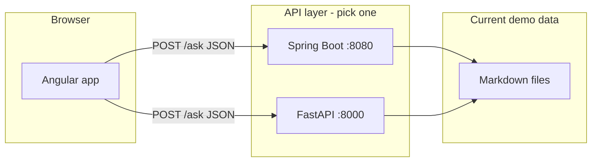

# Development guide

This document describes how the **RAG pipeline demo** is built and how to extend it. It covers the **Angular** frontend, **both** API backends (Spring Boot and FastAPI), configuration, testing, and **optional** PostgreSQL scripts if you add a database later.

---

## Table of contents

1. [Architecture at a glance](#1-architecture-at-a-glance)
2. [Prerequisites](#2-prerequisites)
3. [Repository layout](#3-repository-layout)
4. [Frontend (Angular)](#4-frontend-angular)
5. [Backend (Spring Boot)](#5-backend-spring-boot)
6. [Backend (Python FastAPI)](#6-backend-python-fastapi)
7. [API contract (shared)](#7-api-contract-shared)
8. [Data and indexing](#8-data-and-indexing)
9. [Database (optional extension)](#9-database-optional-extension)
10. [Troubleshooting](#10-troubleshooting)
11. [Suggested next steps](#11-suggested-next-steps)

---

## 1. Architecture at a glance



- **Frontend** calls a single base URL (`apiUrl`) and posts a question.
- **Backends** load markdown, chunk text, build a **TF-IDF** index in memory, retrieve top chunks, and return a **template-style** grounded answer (not a hosted LLM in this repo).
- **No database** is required for the default demo. Optional SQL under `docs/sql/` supports a future design where documents and chunks live in PostgreSQL.

---

## 2. Prerequisites

| Area | Tooling | Notes |
|------|---------|--------|
| Frontend | Node.js **18+**, npm | Angular CLI is pulled via `devDependencies`; `npm start` runs `ng serve` |
| Spring backend | **JDK 17+**, Maven **3.9+** | `mvn spring-boot:run` from `spring-backend/` |
| Python backend | **Python 3.10+**, pip | Virtual environment recommended |
| Optional DB | **PostgreSQL 14+** | Only if you apply scripts in `docs/sql/` |

Verify versions:

```bash
node -v
npm -v
java -version
mvn -v
python --version
```

---

## 3. Repository layout

| Path | Purpose |
|------|---------|
| `frontend/` | Angular standalone app, animations, HTTP client |
| `spring-backend/` | Java Spring Boot REST API, TF-IDF RAG |
| `backend/` | Python FastAPI REST API, scikit-learn TF-IDF |
| `docs/architecture.md` | High-level system overview |
| `docs/DEVELOPMENT.md` | This file |
| `docs/sql/` | Optional PostgreSQL schema + seed (not wired to services) |

---

## 4. Frontend (Angular)

### 4.1 Stack and tooling

- **Angular 18** (standalone components, no NgModule root requirement for the app shell)
- **RxJS** for HTTP observables
- **Angular animations** (`@angular/animations`) for pipeline step feedback
- **Build**: `@angular-devkit/build-angular` (application builder), **Vite-based** dev pipeline under the hood in recent Angular versions

### 4.2 Important files

| File | Responsibility |
|------|----------------|
| `frontend/package.json` | Scripts: `start` → `ng serve --open`, `build` → `ng build` |
| `frontend/angular.json` | Project name, build output, dev server defaults |
| `frontend/tsconfig.json` / `tsconfig.app.json` | Strict TypeScript; `include` covers `src/**/*.ts` |
| `frontend/src/main.ts` | Bootstraps `AppComponent` with `provideHttpClient()` and `provideAnimations()` |
| `frontend/src/environments/environment.ts` | **Production** `apiUrl` (direct Spring URL, default `http://127.0.0.1:8080`) |
| `frontend/src/environments/environment.development.ts` | **Development** `apiUrl: '/api'` — proxied to Spring by `proxy.conf.json` |
| `frontend/proxy.conf.json` | Dev-only: `/api` → `http://127.0.0.1:8080` with path rewrite (same-origin calls from the browser) |
| `frontend/src/app/app.component.ts` | Question state, `HttpClient.post` to `/ask`, step animation timing |
| `frontend/src/app/app.component.html` | Template: textarea, pipeline steps, answer, context cards |
| `frontend/src/app/app.component.css` | Layout and visual styling |

### 4.3 Development workflow

1. Start **one** backend (Spring on 8080 or FastAPI on 8000).
2. Set `frontend/src/environments/environment.ts` → `apiUrl` to match.
3. From `frontend/`:

   ```bash
   npm install
   npm start
   ```

4. The dev server typically serves at **`http://localhost:4200`** (Angular CLI default). The terminal prints the exact URL.

**Spring + Angular in this repo:** Start Spring **first** on port **8080**, then `npm start`. The Angular CLI loads `proxy.conf.json` (see `angular.json` → `serve.options.proxyConfig`). Development builds replace `environment.ts` with `environment.development.ts`, so HTTP calls go to **`/api/ask`** and **`/api/health`**, which the proxy forwards to **`http://127.0.0.1:8080/ask`** and **`/health`**. That keeps the browser on a single origin and avoids CORS preflight issues during local development.

### 4.4 How the UI maps to the RAG story

1. **User input**: `[(ngModel)]` binds the question string.
2. **Pipeline animation**: `setInterval` advances `activeStep` while the HTTP request is in flight (visual parallel to async work; not a literal per-stage backend callback).
3. **Request**: `POST { apiUrl }/ask` with body `{ "question": "<text>" }`.
4. **Response**: Renders `answer`, `context[]` (source + snippet), and `steps[]` (currently shown implicitly via the flow; you can extend the template to list `steps`).

### 4.5 Extending the frontend

- **Environment-specific URLs**: Production uses `environment.ts`; local dev uses `environment.development.ts` via `fileReplacements` under the `development` build configuration in `angular.json`.
- **Dev proxy**: Already configured — `proxy.conf.json` + `apiUrl: '/api'` in development. To point at another host, edit `proxy.conf.json` `target` (or add multiple context paths).
- **Stronger typing**: Move `AskResponse` to `src/app/models/ask-response.model.ts` and import in the component.
- **Routing**: Add `AppRouting` and separate pages (e.g. “Playground”, “Architecture”, “Metrics”) using `@angular/router` (already a dependency).

### 4.6 Build for production

```bash
cd frontend
npm run build
```

Artifacts land under `frontend/dist/` per `angular.json` `outputPath`. Serve the static files with any HTTP server or integrate with Spring as static resources if you consolidate into one deployable.

---

## 5. Backend (Spring Boot)

### 5.1 Stack

- **Spring Boot 3.3.x**, **Java 17**
- **spring-boot-starter-web**: REST controllers, Jackson JSON
- **spring-boot-starter-validation**: `@Valid` on request bodies
- **No Spring Data / JDBC** in the default demo (in-memory index only)

### 5.2 Package layout

```
spring-backend/src/main/java/com/example/ragdemo/
  RagDemoApplication.java          # @SpringBootApplication entry point
  config/CorsConfig.java           # Global CORS for browser dev
  controller/RagController.java  # HTTP mapping
  dto/                             # AskRequest, AskResponse, ContextSnippet, HealthResponse
  model/SourceChunk.java           # source filename + chunk text
  service/RagService.java          # Load MD, chunk, TF-IDF, retrieve, compose answer
```

### 5.3 Lifecycle and indexing

1. **`@PostConstruct` (`RagService.init`)** runs after the bean is created:
   - Loads `classpath:stopwords.txt` into a `Set`.
   - Resolves `classpath:data/*.md` via `PathMatchingResourcePatternResolver`.
   - For each file: read UTF-8 text → `splitIntoChunks` (size **450**, stride **80%** = **360** characters) → `SourceChunk` list.
2. **`buildIndex`**:
   - Tokenizes each chunk (lowercase, letters only, stopword removal).
   - Builds a sorted vocabulary across all chunks.
   - Computes document frequency, **smoothed IDF** (same family as scikit-learn’s smooth IDF style: `log((1+N)/(1+df)) + 1`), TF-IDF weights, **L2-normalized** rows.
3. **Query time (`ask`)**:
   - Tokenize question → query vector (same IDF, L2 norm) → cosine similarity as dot product → top **3** with score **> 0**.
   - If none: returns the same “no matching context” payload as Python.
   - Else: builds the same narrative answer string pattern as Python (including `...` suffix on the detail prefix).

### 5.4 Configuration

| Setting | File | Default |
|---------|------|---------|
| Server port | `src/main/resources/application.properties` | `8080` |
| Application name | same | `rag-pipeline-spring` |

### 5.5 Run and test

```bash
cd spring-backend
mvn spring-boot:run
```

```bash
mvn test
```

`RagDemoApplicationTests` verifies the Spring context starts and that a sample `ask(...)` returns non-empty context.

### 5.6 Extending the Spring backend

- **Tune chunking**: Constants in `RagService.splitIntoChunks` (or externalize to `@ConfigurationProperties`).
- **Swap retrieval**: Replace TF-IDF with embeddings + vector store; keep DTOs stable for the Angular client.
- **Add persistence**: Introduce Spring Data JPA + Flyway/Liquibase; map tables described in `docs/sql/001_schema_documents_chunks.sql` (see [Section 9](#9-database-optional-extension)).

---

## 6. Backend (Python FastAPI)

### 6.1 Stack

- **FastAPI** + **Uvicorn**
- **scikit-learn**: `TfidfVectorizer` (English stop words), `cosine_similarity`

### 6.2 Important files

| File | Responsibility |
|------|----------------|
| `backend/app/main.py` | App, CORS, routes, `RAGIndex` class |
| `backend/data/*.md` | Knowledge files (same conceptual content as Spring `resources/data`) |
| `backend/requirements.txt` | Python dependencies |

### 6.3 Indexing behavior

- Chunks: **450** characters, stride **360** (`int(chunk_size * 0.8)`), whitespace-normalized like Spring.
- Retrieval: top **3**, **score > 0** only.
- Responses mirror Spring’s JSON field names and semantics.

### 6.4 Run

```bash
cd backend
python -m venv .venv
# Windows: .venv\Scripts\activate
pip install -r requirements.txt
uvicorn app.main:app --reload --port 8000
```

### 6.5 Extending the Python backend

- **Module layout**: Split `main.py` into `rag/index.py`, `rag/chunking.py`, `api/routes.py` as the project grows.
- **Config**: Use `pydantic-settings` for `DATA_DIR`, chunk sizes, and model API keys.
- **Persistence**: Load chunks from PostgreSQL instead of only `*.md` on disk.

---

## 7. API contract (shared)

Both backends implement the same surface for the demo UI.

### `GET /health`

**Response (JSON)**

| Field | Type | Description |
|-------|------|-------------|
| `status` | string | `"ok"` when healthy |
| `chunks_indexed` | number | Count of text chunks in memory |

### `POST /ask`

**Request body**

```json
{
  "question": "string (required, non-blank when validated)"
}
```

**Response body**

| Field | Type | Description |
|-------|------|-------------|
| `answer` | string | Grounded narrative (demo uses a fixed template + retrieved excerpt) |
| `context` | array | `{ "source": "filename.md", "snippet": "..." }` |
| `steps` | array of strings | High-level pipeline labels for UX or logging |

**Validation**

- Spring: `AskRequest` uses `@NotBlank` on `question` → **400** if invalid (default Spring behavior).
- FastAPI: Pydantic model with `str` → empty question may still hit retrieval logic after `strip()`; align stricter validation if you need parity.

---

## 8. Data and indexing

### 8.1 Where content lives

| Backend | Markdown location |
|---------|-------------------|
| Spring | `spring-backend/src/main/resources/data/*.md` |
| Python | `backend/data/*.md` |

To add knowledge: drop new `.md` files in the appropriate folder and **restart** the service (index is built at startup in both implementations).

### 8.2 Stopwords (Spring only)

`spring-backend/src/main/resources/stopwords.txt` — one token per line, `#` comments ignored. Python uses scikit-learn’s built-in English stop word list (not identical word-for-word to the file, but behavior is comparable for this demo).

---

## 9. Database (optional extension)

### 9.1 Current state

The shipped **Spring** and **FastAPI** services **do not connect to a database**. All retrieval state is **in-memory** after startup.

### 9.2 When a database helps

Consider PostgreSQL (or another store) when you need:

- **Durable** documents and chunk history  
- **Multi-tenant** isolation and ACLs  
- **Ingestion queues** and async embedding workers  
- **Hybrid search** (BM25 + vectors) with **pgvector**  
- **Audit** trails (`query_audit` table is sketched in the SQL)

### 9.3 Provided scripts

| Script | Purpose |
|--------|---------|
| `docs/sql/001_schema_documents_chunks.sql` | Tables: `documents`, `chunks`, `query_audit`; trigger to maintain `updated_at` on `documents` |
| `docs/sql/002_seed_sample_data.sql` | Idempotent sample inserts (`ON CONFLICT DO NOTHING`) |
| `docs/sql/README.md` | How to run with `psql` |

**Apply order:** `001` then `002`. See `docs/sql/README.md` for connection examples.

### 9.4 Integrating scripts with the services (not implemented)

To use these tables in code you would typically:

1. Add **Spring Data JDBC/JPA** + **Flyway** migrations (copy SQL into `src/main/resources/db/migration/`), or SQLAlchemy + Alembic on Python.  
2. On startup or on a schedule, **load** `chunks.body` (and optional embedding columns) into your vector index or BM25 engine.  
3. Keep **`/ask` JSON** stable for the Angular app, or version the API (`/v2/ask`).

### 9.5 Optional pgvector note

`001_schema_documents_chunks.sql` contains a **commented** example for an `embedding` column. Installing the **`vector`** extension and uncommenting that line is optional and environment-specific.

---

## 10. Troubleshooting

| Symptom | Likely cause | What to try |
|---------|----------------|------------|
| Browser shows connection error in UI | Backend not running or wrong `apiUrl` | Start Spring (8080) or FastAPI (8000); match `environment.ts` |
| CORS errors | Rare with current permissive CORS; proxy misconfig | For Angular dev, use `proxy.conf.json` or ensure backend allows your dev origin |
| Spring fails at startup with “No markdown files” | Missing `resources/data/*.md` | Restore markdown files under `spring-backend/src/main/resources/data/` |
| Python fails at import time similarly | Missing `backend/data/*.md` | Restore markdown files |
| Empty retrieval for every question | Over-aggressive stopwords / tokenizer mismatch | Add domain terms to content or relax stopword list (Spring file or sklearn params) |
| `mvn` / `java` not found | JDK/Maven not on PATH | Install JDK 17+, Maven; restart terminal |

---

## 11. Suggested next steps

- **Real generation**: Call an LLM with a prompt that includes only `context` snippets (citations, refusal on empty context).
- **Embeddings**: Store vectors in pgvector or an external vector DB; keep chunk metadata in PostgreSQL.
- **Observability**: Add Micrometer / OpenTelemetry on Spring and structured logs on FastAPI; log `steps` and latency per stage.
- **CI**: GitHub Actions matrix: `frontend` (`npm ci && npm run build`), `spring-backend` (`mvn -B verify`), `backend` (`pip install && pytest` once tests exist).

For a concise architecture narrative, see `docs/architecture.md`. For day-to-day commands, see the root `README.md`.
